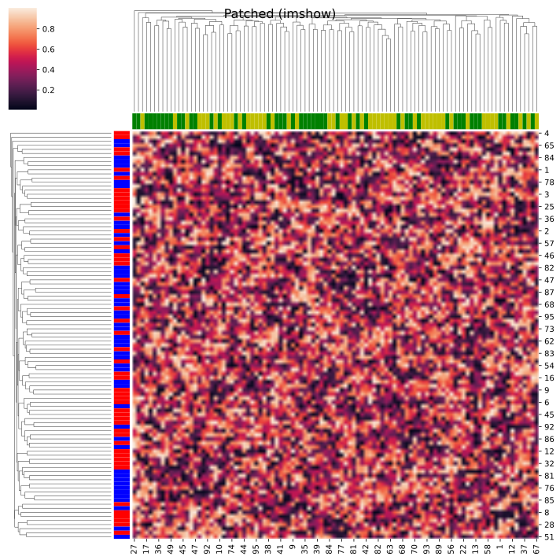

# clustermap-imshow

A monkey patch for `seaborn.clustermap` that uses `imshow` instead of `pcolormesh` (rectangles) for rendering the heatmap.

## Why?

Rendering large heatmaps with `seaborn.clustermap` can be extremely slow in web browsers (e.g., when using `jupyter` or exporting to SVG/HTML) because it creates thousands of individual rectangle objects (QuadMesh). 

By switching to `imshow`, the heatmap is rendered as a single image, which is significantly faster and more memory-efficient for large matrices while maintaining pixel-perfect accuracy.

## Comparison

For a 100x100 matrix exported to SVG:

| Metric | Original (QuadMesh) | Patched (imshow) | Improvement |
| :--- | :---: | :---: | :---: |
| **File Size** | 1953 KB | 128 KB | **~93% smaller** |
| **Render Time** | 0.63s | 0.26s | **~58% faster** |

| Original (QuadMesh) | Patched (imshow) |
| :---: | :---: |
|  |  |

*Note: Visually they are identical, but the patched version is much more performant for large datasets.*

## Installation

This is a local package. You can install it in your environment using `uv`:

```bash
uv pip install -e .
```

## Usage

Apply the patch at the beginning of your script before calling `sns.clustermap`.

```python
import seaborn as sns
import numpy as np
from clustermap_imshow import apply_patch

# Apply the monkey patch
apply_patch()

# Create a large dataset
data = np.random.rand(1000, 100)

# This will now use imshow internally
g = sns.clustermap(data, figsize=(10, 15))
```

## Running Examples

You can run the comparison script to generate the SVGs and see the performance metrics:

```bash
uv run examples/compare_rendering.py
```

## Features

- **Performance**: Dramatically faster rendering and smaller file sizes for SVG/PDF exports.
- **Compatibility**: Supports `vmin`, `vmax`, `cmap`, `norm`, and `annot=True`.
- **Accuracy**: Uses `interpolation="none"` and careful coordinate alignment to match the original `seaborn` output exactly.
